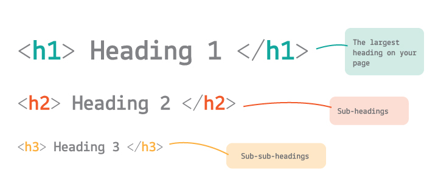
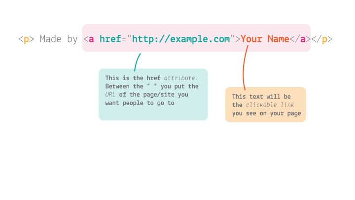
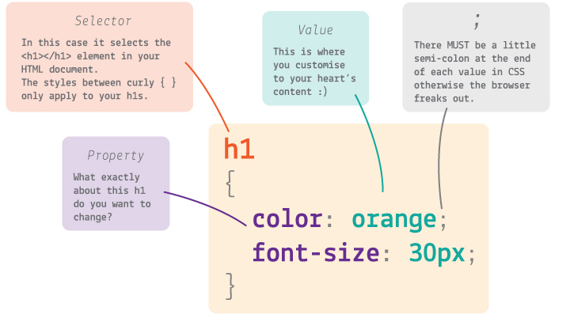

<!--
- [ ] **Intro**. Why the Web is great and why being Web-literate is fundamental these days. - JDM contributes
- [ ] **Sketch** out your portfolio. Checklist: images, texts (name, blurb, project description, links, contact details). 
- [ ] Some storytelling stuff? - JDM to provide portfolio bants as inspired
- [ ] `_base.css` with a template to **remix**
- [ ] Embed videos
- [ ] make sure we're using Chrome.
- [ ] Animated gif? - JDM to talk about how Giphy had $300 million invested. GIFs are big business!
- [ ] cropping images and saving them for Web
-->

# Build your own Web portfolio

## Why?

* Why are we here today?

* Why should you have an online portfolio?

* Why bother with the Web?

### How many hours do you spend on the Web every day? 

Pretty much anything you do is in some way related to the Web. 

You communicate with your friends on the Web, you buy and sell stuff from strangers, you consume entertainment (music, videos, pictures), you find information, you can find jobs, and you can promote yourself on the Web...

### Become Web-literate

In a short time (~20 years) the Web has disrupted every industry it touched. The creative industries are no exception. 

<!--
Today is not about becoming professional coders (although this could be your starting point), but rather to become **confident in tinkering with code**. To see code as a **toolbox**, and not something **scary** or too **complex**.
-->

No matter what your dream job is, as a **creative professional in the 21st century you can’t be Web-illiterate**. Just like you have to be able to read and write, and do some maths. 

You need to understand a bit of code and have a presence online. 

<!-- You don't have to be a geek/nerd, the Web is for *everyone*. -->

Becoming Web-literate will enable you to use the Web as an **open platform**, a place where you can be a **maker**, instead of a **consumer**. 

<!-- Also it's a highly paid industry. -->

## Draw *the Web*!	

> But what do you mean by *the Web*? 

Imagine you have to **explain** what the Web is to an alien, or to your grandma. 

**Draw what the Web means to you** *personally*. No need to make a technical drawing.

You have ~10 minutes to **sketch your idea** out.

<!--
(globe/planet, connections, computers, brands)
(clouds, trees, cats)
-->

## Today

You'll learn how to:

* Organise your work to **tell the story** of your projects
* Build an **online one-page portfolio** for your work
* [Learn **HTML & CSS**](#html-css-crash-course)
* **Publish** your portfolio online

<!-- Bringing storytelling and coding together to make something that is useful to you, today. -->

A finished **demo** of what we will build together is at [j.mp/html-css-portfolio-demo](http://j.mp/html-css-portfolio-demo). Click `Remix` to reveal all its **source code**.


# HTML & CSS crash course

You write HTML to **structure** your content. Today you will: 

* Create several types of **text** (paragraphs, headings, quotes)
* Create **links** to other Web pages (eg: your blog)
* Add **images** (eg: of your work)
* **Embed** other media (eg: YouTube videos, tweets etc.)

You write CSS to **style** your content. Today you will:

* Design your page's **typography**
* Set your page's **colours**
* Get images to fill up the whole browser's window, without loosing their original aspect ratio
* Position elements in the horizontal and vertical centre of the page
* Create a *curtain reveal* effect

> Go to [thimble.mozilla.org](https://thimble.mozilla.org/) and sign up (it's free). 

> Then log in and click on `Start a project from scratch`.


## 1. Content first

It's good practice to build the **HTML** first, and then make it _stylish_ with CSS. This approach is called *content first*.

### HTML basics

HTML is a *markup* language, which you use to *format your content*. 

Essentially, you wrap content inside bits of code called tags.

`<tag> content </tag>`

The bits of code inside angle brackets `<` and `>` are instructions for the computer:

* They describe the content they wrap 
* Define where it starts `<tag>`
* Define where it ends `</tag>`

For example, this is how you wrap a paragraph of text in `p` tags:

`<p> This is a paragraph. </p>`

`p` stands for *paragraph*, of course.

### HTML skeleton

Thimble created an HTML skeleton for us, containing the basic **building blocks**: `html`, `head` and `body` tags.


Every HTML document, at the bare bones, needs to have this structure

```html
<!doctype html>
<html>
	<head>
		...
	</head>
	<body>
		...
	</body>
</html>	
```

### Head

> In the `head` you can change the `title`.  
	
Later, you'll add links to external resources like *stylesheets* and *meta* information.

What you put in the `head` is not visible in the page.

### Body

We're dividing our page into sections.

> Create a few empty `section` tags inside the `body`.
	
> ```html
...
	<body>
		<section></section>
		<section></section>
		<section></section>
		<section></section>
		<section></section>
	</body>
</html>	
``` 

### Headings

> In the **first section** add a `div`. Inside that, add a **heading** (`h1`) and a **sub-heading** (`h2`). 
 
> ```html
...
<body>
	<section>
		<div>
			<h1>Your name</h1>
			<h2>Your specialties, eg: film maker</h2>
		</div>
	</section>
...
```



These will be the most important pieces of information in your page (for search engines like Google).

### Images

Images are worth thousands of words, they say. So let's upload one to start with.

> To upload an image to Thimble, click on the green `+` on the top-left and the `Upload...`

The **image** to upload could be your logo or your profile picture.

> Once you've uploaded your picture, in that same `div`, underneath the headings, add an `` code and set its `src` (source) to your image file, like so

> ```html
	...
	<h2>Your specialties, eg: film maker</h2>
	
</div>
...	
```

> Don't worry if the image is too big for now. You'll *style* it later! 

### Text

> In the second section we'll have **textual content**, so let's write something in there.  
	
> ```html
...
<section> ... this is the first section ... </section>
<section>
	<p>Write something here to introduce your project and the ideas behind it.</p>
	<p>A little information about the process you took from research through to the development.</p>
	<p>You process is important!</p>
</section>
...
```

`p` is for *paragraph*.

### Hyperlinks

> Add **hyperlinks** to your content using the `a` element (`a` is for *anchor*).
	
> ```html
<a href="http://example.com">the clickable text</a>
```

For instance:
```html
<section>
	<p>Influenced by the playful approaches to image-making used by Dadaist <a href="http://www.whitechapelgallery.org/exhibitions/hannah-hoch/">Hannah Höch</a>, I gathered a collection of portraits (Vogue portraits from the 1920's-40's and more current artist portraits) to create a collage of anonymous parts.</p>
</section>
```



### Contact details

> Add your **contact details** to the last section.
 
> ```html
...
	<section>
		<div>
			<h3>Say hello!</h3>
			<p>YOUR_EMAIL@example.com</p>
		</div>	
	</section>
</body>
</html>	
```

### Publish your project

> Now click `Publish` to see how your app looks so far. :+1:


## 2. Style later

Now the fun part: **CSS**!

### CSS basics

You use CSS to style HTML.

CSS looks and works differently than HTML. 

```css
selector
{
	property: value;
	property: value;
}
```

The part before the curly brackets `{` and `}` is the **selector**. This ***selects* the element(s)** from your HTML document.

In CSS you can select multiple HTML elements in one go.

For example, to select **all** paragraphs you can write

```css
p
{
	/* your styles for paragraph here */
}
```

CSS **properties** define how HTML elements are displayed.



The first bit is the property name, eg `color`, and the second bit is the value, eg `green`. They are separated by a `:` colon, and you MUST end each line of CSS with a `;` semicolon (for real, otherwise your browser will choke).

For example ...

```css
p
{
	color: green;
}
```

... will turn *every* paragraph in your HTML green.

### Play around a bit

> Let's spend the next 5-10 minutes getting familiar with CSS. It doesn't matter if your site looks a bit funny for now. Things you can do:

> * change the `color` of your `h1` or `h2` elements
> * align some elements to the `center` (*google* how to do it)
> * hide some elements
> * change the `background-color` of the whole page 

> What else would you like to do? Try and *google* it first, then we can do it together (if it's not too whacky).

### Search for solutions! 

Being a creative in the 21st century is about searching for answers, every day. You don't need to remember everything and you don't need to learn everything immediately! 

**All the answers can be found on the Web! As creatives, we better get used to searching online for solutions.**

### Inspect websites you like

Did you know, you can see the code which has created every site on the Web? You can use the **Web Inspector** to do this. It's like x-ray specs for websites.

> Go to a website (any website) and right-click anywhere on that page, then select `Inspect` (or `Inspect Element` in some browsers).

On the **left panel** of the `Elements` tab you can see all the HTML code for the page you're inspecting. By clicking on an HTML element you'll reveal all the CSS applied to it, on the **right panel**.

You can also play with this code and change the way your favourite websites look (but don't worry, your changes won't affect how other people are experiencing that site). :scream:

> Go to a site you like, right-click > `Inspect` and then see if you can find which colours it uses.

<!--
### Normalize

We want to tell the browser not to mess with our style.   
  
So we're going to use a little CSS utility called [**normalize.css**](https://necolas.github.io/normalize.css/), which resets the default browser's styles and provides a consistent common ground for our own styles. 

> Search `normalize.css` in Google and click on the first link. 

> Click the `Download` button and save the file by going to *File* and *Save Page As...*.

> Now upload that file to Thimble.

In order for your page to pick up the Normalize stylesheet, you'll need to add a `link` in the `head`, which will point to the `normalize.css` file.  
 
> ```html
...
<head>
	...
	<link rel="stylesheet" href="normalize.css">
	<link rel="stylesheet" href="style.css">
</head>
```
-->

### Your style

<!--As you can see, `normalize.css` has flattened your page. Now you can start building your own style. -->

There's a `link` in your `head` which points to a CSS file called **style.css**. This is where you add your styles.

### Typography

Text is by far the major carrier of information on the Web, so it's good practice to start with **typography**, or *type setting*. That means defining how texts are going to look, which fonts your portfolio is going to use, and the proportions between them in your layout. 

> You can grab a free **font** from [Google Fonts](https://www.google.com/fonts): 

> 1. Pick a typeface you like
> * Click on `Quick-use` (the button with an arrow pointing to the right).
> * Choose the font styles you want to use
> * Copy the `link` code for it and paste it in your app `head` in Thimble. 

>	Where? Before `style.css`

> ```html
...
<head>
	...
	<link href='https://fonts.googleapis.com/css?family=Roboto+Slab:400,300,700' rel='stylesheet' type='text/css'>
	<link rel="stylesheet" href="style.css">
</head>
```

> In `style.css`, define the font for the `body` element (all other elements will inherit it). 

> ```css
body
{
	font-family: 'Roboto Slab', sans-serif;
}
```

We're using the font *Roboto Slab* as an example, but you can pick **whichever font** you like and change your CSS code accordingly. There are more than 700 fonts available on Google Fonts!
	
Then you can set **more specific rules** for headings, paragraphs and bold elements. For instance, you could use a different font just for headings, as well as changing many other aspects of your typography:
	
* `font-family` 
* `font-size`
* `font-weight`
* `font-style`
* `line-height`
* `letter-spacing`
* `word-spacing`
* `text-align`
* `text-decoration`
* `text-transform`
* `text-indent`	

> `font-family`, `font-size` and `color` are a great place to start!

### Readability

We will centre the sections with text and make them easier to read.

> In `index.html` add `class="content"` to all the `section` elements that contain text.

> ```html
...
<section class="content">
	<p>Write something here to introduce your project and the ideas behind it.</p>
	<p>A little information about the process you took from research through to the development.</p>
	<p>You process is important!</p>
</section>
...
```

> Then in `style.css` create a rule for those `section` elements *classified* as `content`. 

> ```css
.content 
{
	margin: 2rem auto;
	max-width: 40rem;
	padding: 0 1rem;
}
```

`.` is a shortcut for `class`.

### Full-size

Let's add some **full-size images**.   
  
First we want to get some `section` elements in our page to take the full browser height. 

> Create a `.full` class and give it a `height: 100%;` property.

> ```css
.full
{
	height: 100%;
}
```

This is not enough though. 

It is important to understand that `height: 100%;` means _the full height of the parent element_. It doesn't magically mean *the height of the browser window*. So if you want your `.full` sections to have the height of the browser window, setting `height: 100%;` isn’t enough.

_Why?_ Because the parent of your `section` (`body`) has its height set by default to `auto`, which means it is sized according to its _content_. You can try adding `height: 100%;` to the `body` element ... and it is still not enough.

_Why?_ Because the parent of `body` (`html`) has also its height set by default to `auto`. Now what if you try to add `height: 100%;` to the `html` element? It works!

> ```css
html, body
{
	height: 100%;	
}
```

### Background images

Now onto the **images**. We're going to use `background-image` to define a few images that will be applied to the background of `.full` elements. 

> Add `background-image` directly into `index.html`. For each `section` with the class `.full` add in `style="background-image: url('image.jpg')"`

> For example:

> ```html
<section class="full" style="background-image: url('image.jpg')">
	<div>
		<h1>Your name</h2>
		<h2>Your specialties, eg: film maker</h2>
		
	</div>
</section>
```

By default background-images *tile*, but we want them to take up the whole available screen space, without losing their aspect ratio (no squashing). 

We can achieve that with `background-size`. This property can take various values: pixel sizes, percentages, and then a couple of interesting keywords. 

* `contain` will scale the image so as to be as large as possible providing that it is **contained** within the background positioning area. 
* `cover` instead, will scale the image, this time to be as large as possible so that the background positioning area is completely **covered** by the background image.

> Add `background-size: cover;` to the `.full` rule (so that it will apply to all sections with the `full` class).

> ```css
.full
{
	height: 100%;
 	background-size: cover;
}
```

Let's add some more images in sections with `class="full"`.

> ```html
<section class="full" style="background-image:url('YOUR_IMAGE.jpg')"></section>
<section class="full" style="background-image:url('ANOTHER_IMAGE.jpg')"></section>
```

#### Image sizes

Next we're styling the **logo** / **profile picture**.

By default images will be added to the top-left corner of their *parent*.

If we want it to be centred, we need CSS. 

> Give the `img` a class `profile`.

> ```html
	...
	
</div>
...	
```

> Then set a height and width for your image

> ```css
.profile 
{
	height: 10rem;
	width: 10rem;
}
```

We also can make sure that the `img` is not bigger than its container

> ```css
.profile 
{
	height: 10rem;
	width: 10rem;
	max-width: 100%;
}
```

### Aligning stuff
	
> To make stuff **centred**, create two classes `h-centred` and `v-centred`.

> ```css
.h-centred
{
	display: flex;
	justify-content: center;
	text-align: center;
}
.v-centred
{
	display: flex;
	align-items: center;
}
```

> Add them to your HTML `section`.

> ```html
<section class="full h-centred v-centred" style="background-image: url('image.jpg')">
	<div>
		<h1>Your name</h1>
		<h2>Your specialties, eg: film maker</h2>
		
	</div>
</section>
```

<!--
We can see the `div` has moved into the centre of the screen, but the content inside it is still aligned to the left. Let's add some CSS to fix that. Add some style into the `div`.

```html
<div style="text-align: center">
	<h1>Your name</h2>
	<h2>Your specialties, eg: film maker</h2>
	
</div>
```
-->

### Special effects

Now we want to get that fancy **curtain reveal effect**, so that instead of scrolling with the rest of the page, the background-images will be revealed as we scroll up and down. 

Arguably that will make your page more interesting.

We can achieve this with another CSS property, `background-attachment`. With this property we have two options: 

* `scroll` (default): the background image will scroll with the rest of the content.
* `fixed`: the background image will remain stationary as the rest of the content is scrolled

Which one do we want? Obviously `fixed`.

> Add `background-attachment: fixed;` to `.full`

> ```css
.full
{
	height: 100%;
 	background-size: cover;
 	background-attachment: fixed;
}
```

### Well done!

Now **play around** with it, break it and put it back together! You'll learn tons from that.

This **demo** is at [j.mp/html-css-portfolio-demo](http://j.mp/html-css-portfolio-demo). Click `Remix` to reveal all its **source code**.	


### License

[](http://creativecommons.org/licenses/by-nc-sa/4.0)

This work is licensed under a [Creative Commons Attribution-NonCommercial-ShareAlike 4.0 International License ](http://creativecommons.org/licenses/by-nc-sa/4.0)
